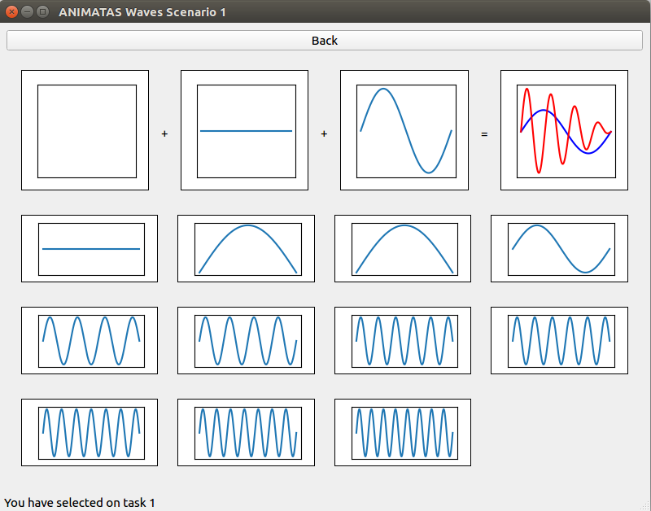
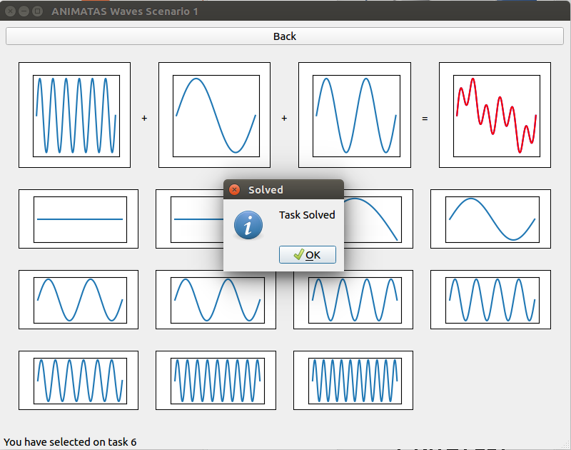

# Scenario 1 - Discrete Waves

This task is based around interference. 
At present it generates a set of random problems that the user has to solve graphically.
This is done using drag-n-drop to move waves into open slots.
Once the combined wave matches the desired wave, the exercise is marked as solved and a 
new exercise can be started.

## Task Selection Page

![Overview of the Task Selection Page with the different states of the exercise]
(exercise_states.png)

In the task selection screen you can choose between different exercises. 
Those with a blue background have not been attempted yet.
A red background signals that the exercise has current progress, but is not finished yet.
A green background indicates a solved exercise.

You can select any exercise by clicking on it.

## Exercise Page

The target wave is shown in red in the top right figure in addition to the current sum of 
the selected waves.
Selected waves are shown in the other figures along the top row, which are referred to
as slots.
Using drag-n-drop you can change a slot to any of the waves displayed below the first row 
of figures.

Once the task is solved, the program will return to the task selection page and a new
exercise can be selected.

Alternatively, using the "back" button, you can return to the task selection page.
In this case the current progress is saved and the exercise will be shown as "unsolved"
maked by a red glow around the borders.
